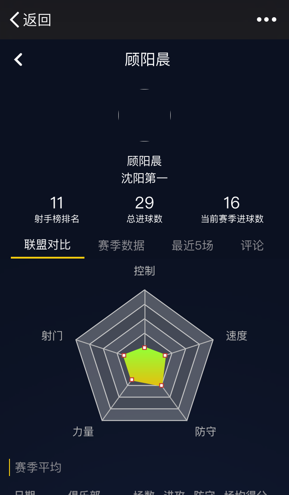
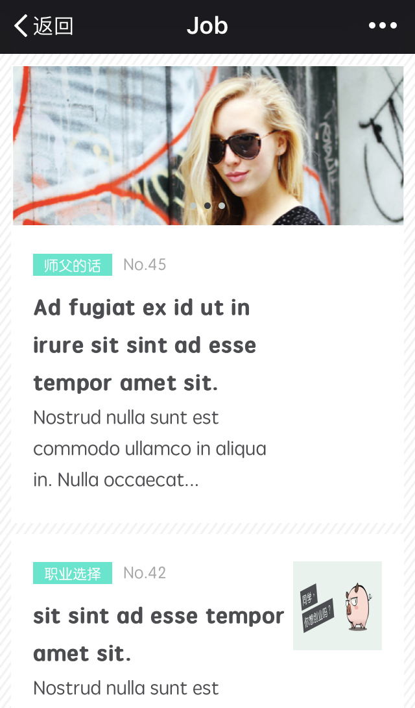
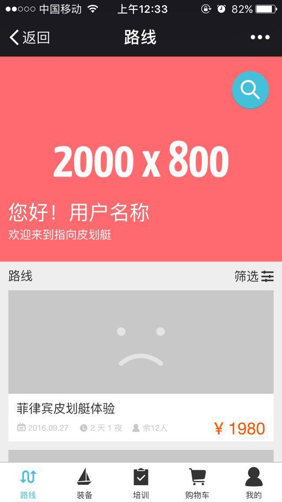
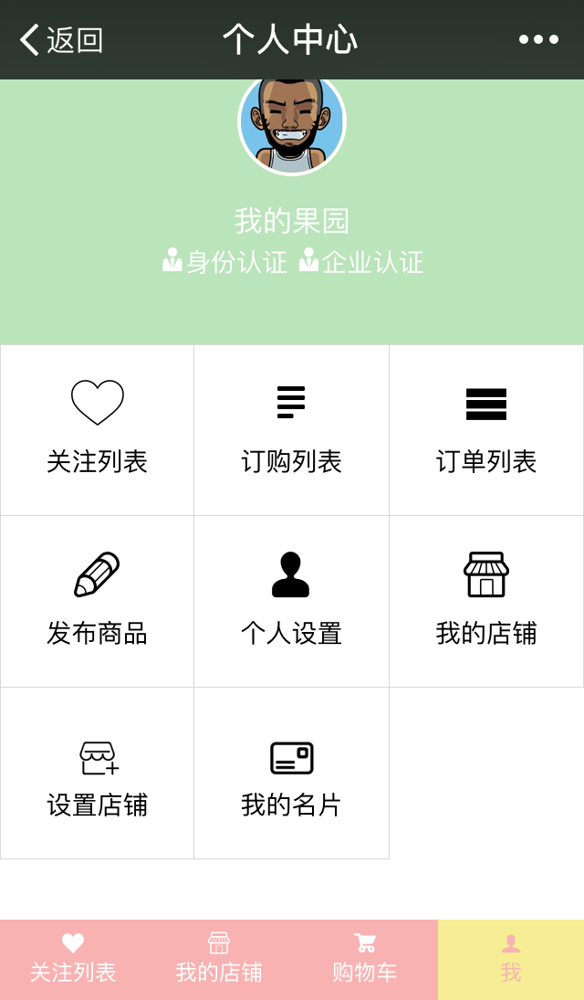
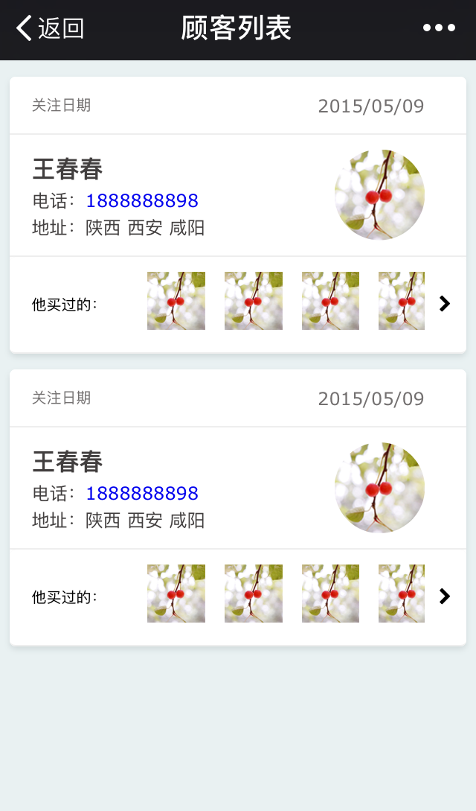

<ul class="my-projects-list" >

  <li class="my-project-item" >
    
      山东大学深圳研究院官网
      [网站请戳](http://www.shz.sdu.edu.cn/shfw/szxydt.htm)
      独立完成的第 1 个上线的项目！公司有一套 Java 开发的建站系统，前端以组件的方式开发页面模版，后端负责渲染数据并生成页面，属于传统的 BS 架构开发模式。要适配 IE7+。
      这个项目从开发、到最后的实施上线，都是我负责的。最终发现，开发是项目流程中最简单的一个环节。
      使用 __gulp__ 构建，__Sass__ 编写 CSS , __Jade (Pug )__ 编写 HTML, 简单的 Jquery。
  </li>
  <li class="my-project-item" >
    
      React 第一个项目
      [demo 请戳](http://sup-polo.zhangxiaoxu.com)
      [原码请戳](https://github.com/vivian-xu/job-src)
      第一次用使用 React 开发的项目。虽然开发过程十分曲折，并且代码和结构都很不好，但是经过了这个项目，进一步的理解了 react 的理念。也进一步喜欢上了 React，它可以使我的思维更加有条理。
      这个项目也是第一真正的与后端对接代码，虽然第一次对接的过程也不是很顺利，但是充分的了解到了与后端共同制定 API 的重要性以及 mock 的重要性。
      使用 __webpack__ 打包构建，__React__ + __React-router__, __Sass__ 编写 CSS , __Jquery__。
  </li>
  <li class="my-project-item">
    
      React 第二个项目

      [原码请戳](https://github.com/vivian-xu/job-src)
      [demo](http://shifu.zhangxiaoxu.com)

      这个项目是比较简单的项目，相对于第一个 React 来说更得心应手了。
      在这个项目上努力使自己的代码更加规范，整洁，结构更加的合理，并且尽量使性能更优。将组件更细分，储存在 state 里的变量尽量减少，利用 PureComponent 减少不必要的 Mount 等等。
      为了改善用户体验，加入 Loading 和 无限滚动加载等小组件。
      使用 __webpack__ 打包构建，__React__ + __React-router__, __原生 JS + ES6, 用 __superagent-mock__ mock 数据 ,____Sass__ 编写 CSS
  </li>
  <li class="my-project-item">
    
      我是在做完第一个 React 项目后，开始首次尝试 Vue.js 的。这次是跟一个比较有经验的前端工程师合作写的。但是其实我是以学习为主，所以最终我也没有写多少行，但是我认真的读了他的代码 ( 环境配置没太看, 其实是没太看懂 ...)。

      学到很多，首先，我知道了比较正规的大公司的前端开发的正规的流程是什么。其次，这个项目给我真实的展示了怎么样划分组件。也学到了一个项目大概的内容规划。还有这个项目也是用了 mock server，更加坚定了我之后一个项目使用 mock server 的想法。当然最基础的还是如何使用 Vue 写一个简单的项目。

      [原码请戳](https://github.com/vivian-xu/sup-shop-src)
  </li>
  <li class="my-project-item" >
    
      设计并实现页面。
      产品主要针对移动端用户 ( 尤其微信 )。
      使用 __weui__, __Css__ , 后期加入 __gulp__ 构建,  最终实现静态页面。
      这是在公司做的第一个项目，最难的部分就是要自己设计页面。参考了很多网站，网站也实现了一大部分，但是最终也是 __达不到满意__的效果。新来了设计师后就不再开发这个版本了。
  </li>
  <li class="my-project-item" >
    
      是开发的第二个版本的产品，与设计师和另一名前端程序员合作开发。
      相对于上一个版本来说，有了专业的设计师开发更加愉快～
      项目依旧需要适配基本的手机端。
      基本上纯静态页面，加入了少量的 Jquery。
      使用 __gulp__ 构建,  __Sass__ 编写 CSS , 加入少量 weui 实现的。
  </li>
</ul>

  联系我

  Email: hi@zhangxiaoxu.com

